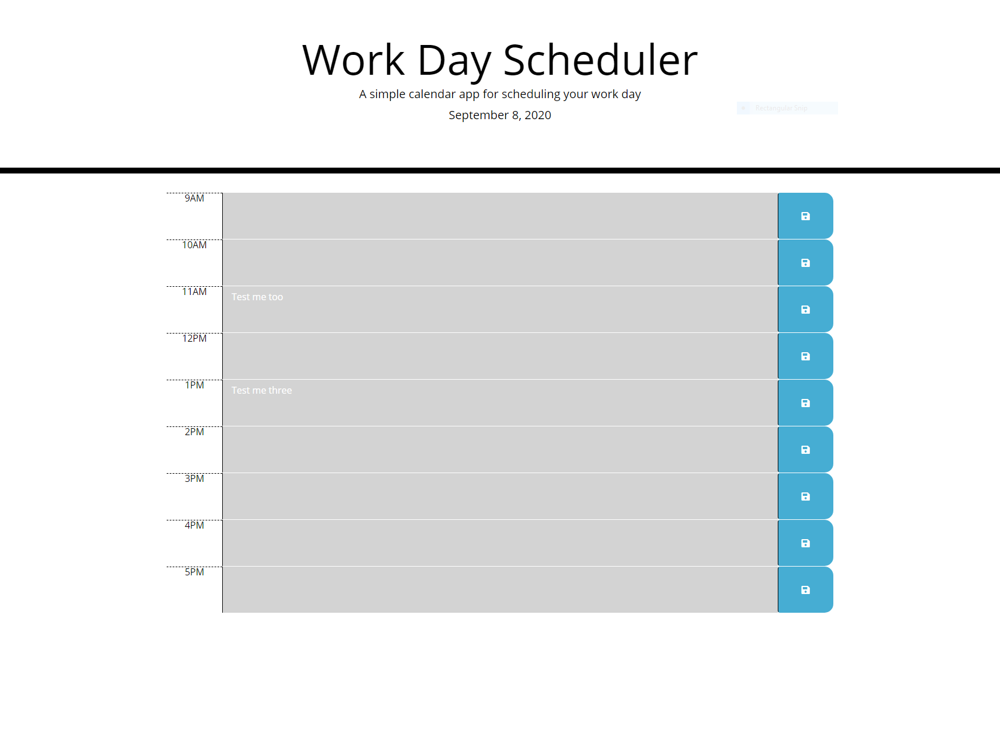

# workday-scheduler-bdd
This workday scheduler will allow the user to save tasks that need to be done in a certain hour timeblock. The color of the time block will change based on what the current hour of the day is, allowing the user to easily identify what time of day it is, and where they sit in their schedule.

## URL of Deployed Website
https://brennandoehring.github.io/workday-scheduler-bdd/

## Screenshot of Deployed Website
